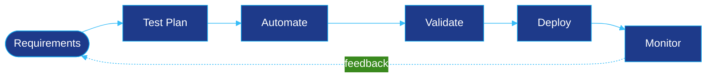

 

 

## 🚀 About Me

I work where **operations, quality assurance, and development** meet. My background runs from on-premise networking to modern cloud platforms, and my goal is simple: **changes that work the first time they reach production.**

I get there by automating repetitive work with PowerShell and Bash, testing APIs and functionality thoroughly, and managing identities and endpoints in a consistent, repeatable way.

 

## ⚡ At a Glance

| | |
|:--|:--|
| 🎯 **Focus** | Infrastructure · QA Automation · Cloud Architecture |
| 🌍 **Environments** | Maritime and web-based platforms, from on-premise networks to the cloud |
| 🤖 **Automation** | PowerShell · Bash · Google Apps Script |
| 🏅 **Certified** | AZ-104 · MD-102 · CCNA |
| 🔧 **Daily tools** | Jira · Postman · Intune · Docker · GNS3 |

 

## 🏗️ Core Engineering Domains

<table>
  <tr>
    <td valign="top" width="33%">
      <h3>🔍 Quality Assurance</h3>
      <ul>
        <li>Functional testing and validation for complex maritime and web platforms</li>
        <li>Defect tracking and sprint backlog management in <b>Jira</b></li>
        <li>Mobile app testing with <b>ADB</b> and <b>scrcpy</b> screen mirroring</li>
        <li>Approval test plans and system requirement documents</li>
      </ul>
    </td>
    <td valign="top" width="33%">
      <h3>🌐 Network &amp; Systems</h3>
      <ul>
        <li><b>GNS3</b> simulation labs, including Alpine Linux and UEFI proxy PXE boot testing</li>
        <li>Mail infrastructure: <b>hMailServer</b>, POP3/IMAP, and Outlook data migrations across distributed endpoints</li>
        <li><b>RHEL</b> server administration</li>
        <li><b>WSL</b> and <b>Docker</b> for containerized application testing</li>
      </ul>
    </td>
    <td valign="top" width="33%">
      <h3>☁️ Cloud &amp; Automation</h3>
      <ul>
        <li>Identity, access, and endpoint management with <b>Microsoft Entra ID</b> and <b>Intune</b></li>
        <li>Threat-intelligence and API monitoring pipelines using <b>PowerShell</b> with Google Apps Script</li>
        <li>Local AI model environments with <b>Ollama</b></li>
      </ul>
    </td>
  </tr>
</table>

 

## 🔄 How I Work

 

## 🛠️ Technical Arsenal

<table>
  <tr>
    <td width="24%"><b>☁️ Cloud &amp; Identity</b></td>
    <td>
      
      
      
      
      
    </td>
  </tr>
  <tr>
    <td><b>⚙️ Systems &amp; Networking</b></td>
    <td>
      
      
      
      
      
    </td>
  </tr>
  <tr>
    <td><b>🧪 QA &amp; Scripting</b></td>
    <td>
      
      
      
      
      
    </td>
  </tr>
  <tr>
    <td><b>💻 Development &amp; AI</b></td>
    <td>
      
      
      
      
    </td>
  </tr>
</table>

 

## 📜 Certifications & Credentials

 

<!-- OPTIONAL: uncomment and edit once you have repos you want to feature.
## 📌 Featured Projects

  
  

-->

## 📊 GitHub Analytics

  
  

  

  

 

## 🤝 Let's Connect

I'm always glad to talk about infrastructure, test automation, or cloud and endpoint management.

